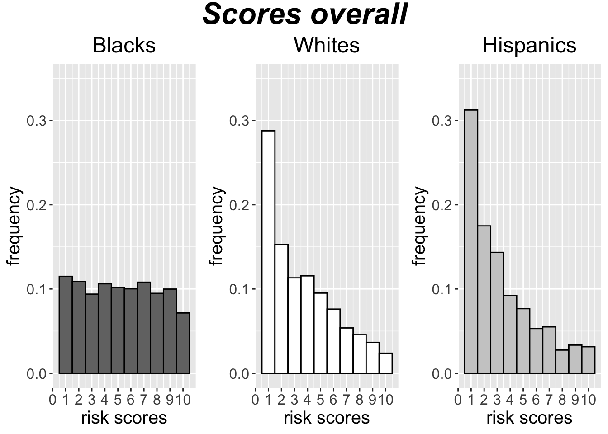
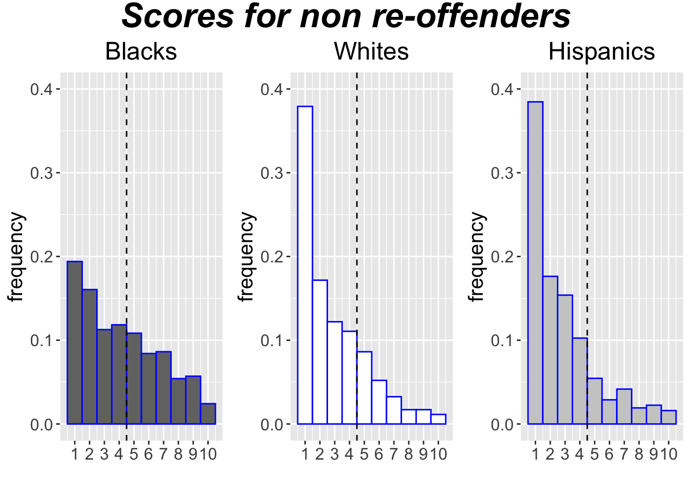
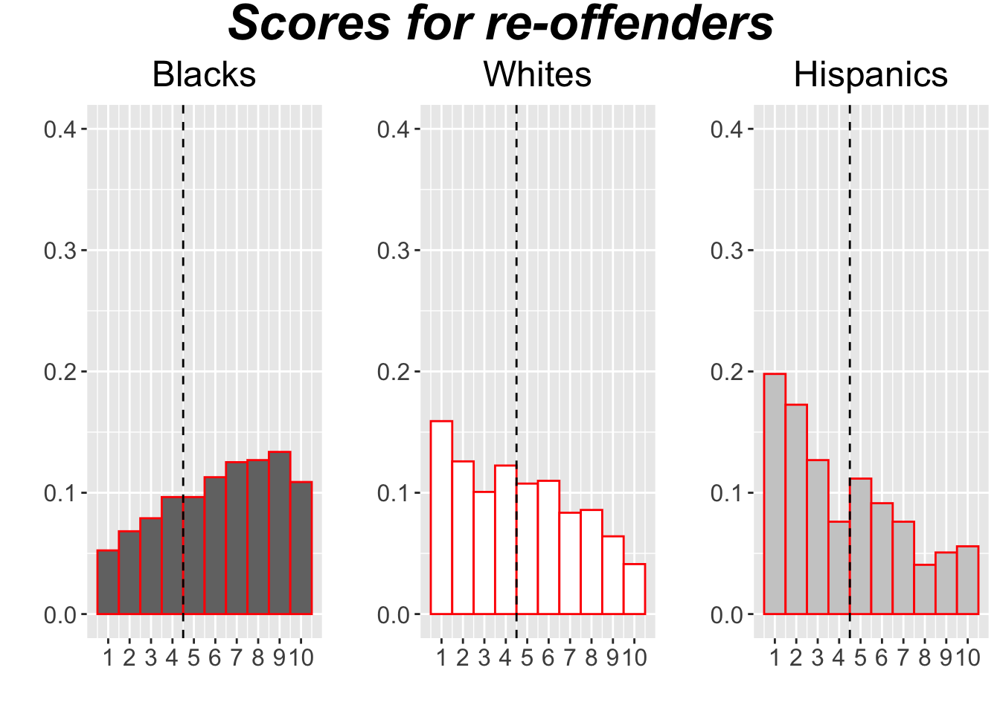

<style type="text/css">

body{ /* Normal  */
      font-size: 20px;
      font-family:'Avenir Next';
      background-color:white;
  }
  
</style>

```{r setup, include=FALSE}
knitr::opts_chunk$set(echo = TRUE)
```


# **Predictive algorithms**

`r tufte::margin_note("We will focus on applications in the criminal justice context. Here, predictive algorithms can be deployed to make decisions about police allocation, preventative detention, bail, 
the severity of punishment, parole.")` 
Predictive algorithms assign *risk scores* to individuals in order to predict an outcome: 
committing a crime, being a crime victim, defaulting on a loan, child maltreatment,
developing a medical condition, etc. They rely on machine learning algorithms (i.e. meta-algorithms) 
to identify correlations between risk factors (predictors) and the outcome of interest. 

## Example 1: Chicago's SAID
One example is Chicago's [Subject Assessment and Information Dashboard (SAID)](http://directives.chicagopolice.org/directives/data/a7a57b85-155e9f4b-50c15-5e9f-7742e3ac8b0ab2d3.html), previously known as SSL (Strategic Subject List). SAID uses the following risk factors: 1. victim of a shooting incident; 2. age during latest arrest; 3. victim of an aggravated battery or assault; 4. trend in criminal activity; 5. arrests for unlawful use of a weapon; and 6. arrests for violent offenses. The goal is to estimate an individual's risk of becoming a victim or possible offender in a shooting or homicide wihin 18 months. 

## Example 2: PSA

Another examples is [Public Safety Assessment (PSA)](https://advancingpretrial.org/psa/) whose aim 
is to predict failure to appear in court or new criminal arrest. 

```{r, fig.margin = TRUE, echo=FALSE,out.width="100%", out.height="100%",fig.cap="Risk factors used by PSA along with the weights for predicting new criminl arrest",fig.show='hold',fig.align='center'}
knitr::include_graphics("PSA-factors-weights.png")
``` 


## Good or bad?

These algorithms facilitate data-based decision making. For example, a [report](https://www.njcourts.gov/courts/assets/criminal/cjrreport.pdf) shows that the adoption of PSA in New Jersey as part of the Criminal Justice Reform reduced the length of time defendants spend in jail following arrest. There was a 20% reduction in the pre-trial jail population in 2017 after PSA was adopted. The ACLU of New Jersey endorsed the adoption of PSA as it helps to eliminate the bail system that disproportionately 
targets the poor.^[www.aclu-nj.org/theissues/criminaljustice/pretrial-justice-reform]

The bad thing is these data-driven algorithms reflect, reproduce, and likely exacerbate, 
existing racial disparities in the justice system.^[Data about US criminal justice system: www.prisonpolicy.org/reports/pie2019.html] We will examine a particular example, COMPAS, which has been the focus 
of a lot of media and scholarly attention.  

# **Northpointe's COMPAS**

Northpointe developed COMPAS (short for Correctional Offender Management Profiling for Alternative Sanctions) as a case management tool for criminal justice practitioners. It can be used for jail, sentencing and 
parole decisions. It calculates two main risks scores, one for *general recidivism* and another for *violent recidivism*. Scores convey the probability that someone would re-offend 
within a certain period of time (usually two years). Risk scores range 
from 1 (lowest) to 10 (highest). 

How are risk scores calculated? Consider the violent recidivism risk score. This score 
depends on the following risk factors: history of noncompliance; education; current age; age-at-first-arrest; history of violence. Each factor is assigned a weight.


> The size of the weight is determined by the strength
of the item's relationship to person offense recidivism that 
we observed in our study data. The weighted items [=risk factors] are 
then added together to calculate the risk score:
>
> Violent Recidivism Risk Score = (agex $*$ w) + (age-at-first-arrestx $*$ w) + (history of violence $*$
w) + (vocation education $*$ w) + (history of noncompliance $*$ w) (p. 29).^[Northpointe (2015), [Practitioner’s Guide to COMPAS Core](https://s3.documentcloud.org/documents/2840784/Practitioner-s-Guide-to-COMPAS-Core.pdf)]

# Scores distribution

```{r, echo=FALSE, fig.margin = FALSE, fig.cap="COMPAS risk score distribution. The distribution is different across racial groups. On average, black people have higher risk scores than white people. ", out.width = '80%'}
 
```


# **ProPublica v. Northpointe**

`r tufte::margin_note("This analysis uses rearrest as a proxy for actual recidivism since we have no way to detect actual criminal activity besides its proxy (such as arrests, convicitions, etc.)")`
ProPublica's 2016 [analysis](www.propublica.org/article/machine-bias-risk-assessments-in-criminal-sentencing) 
of COMPAS found that:

- *False positives classification (FPC):* 23.5\% of whites who didn't re-offend were mis-classifieds as 'high risk' (score $\geq 5$) versus 44.9\% of blacks. *False negatives classification (FNC)*: 47.7\% of whites who re-offended were mis-classified as 'low risk' (score $<5$ ) versus 28\% of blacks. 

ProPublica singled out the group of non re-offenders and compared the percentage of whites in that group mis-classified as high risk to the percentage of blacks in the same group also mis-classified as high risk. It also singled out the group of re-offenders and compared the percentage of whites in that group mis-classified as low risk to the percentage of blacks in the same group also mis-classified as low risk.

```{r, echo=FALSE, fig.margin = TRUE, fig.fullwidth = TRUE, fig.cap="COMPAS risk score distribution for non re-offenders by race"}
 
```
```{r, echo=FALSE, fig.margin = TRUE, fig.fullwidth = TRUE, fig.cap="COMPAS risk score distribution for re-offenders by race"}
 
```

Northpointe, the company that designed COMPAS, responded

- *False positive prediction (FPP)*: Among those labeled  'high risk,' 41\% of whites and 37\% of blacks did not re-offend.
 *False negative prediction (FNP)*: Among those labeled 'low risk,' 29\% of whites and 35\% of blacks re-offended.

Northpointe singled out the group of those labeled 'high risk' by COMPAS and compared the percentage of whites 
in this group who are not re-offenders to the percentage of blacks in the same group who are not re-offenders. It also singled out the group of those labeled 'low risk' by COMPAS and compared the percentage of whites in this group who are re-offenders to the percentage of blacks in the same group who are re-offenders. 

Northpointe made a second rebuttal:

> Differences in the base rates of blacks and whites for general reccidivism (0.51 v.\ 0.39) ... strongly 
affected the *Sensitivity* and *Specificity* tradeoffs observed in the PP [=ProPublica] study. (p. 7-8)^[Northpointe(2016), *COMPAS Risk Scales: Demonstrating Accuracy Equity and Predictive Parity*]

#  Is COMPAS racially biased?

COMPAS's racial disparities in *classification errors* (FPC and FNC) are huge, but the 
racial disparities in *prediction errors* (FPP and FNP) are not significant. So is COMPAS 
racially biased on not?  We are dealing here with two criteria of algorithmic fairness: 

- *Classification parity*:  Equal classification error rates---that is, equal FPC and FNC---across groups

- *Predictive parity:* Equal prediction error rates---that is, equal FPP and FNP---across  groups

COMPAS satisfies predictive parity fairness, not classification parity.`r tufte::margin_note("We will see later in the semester that no algorithm can satisfies both conceptions of algorithmic fairness under realistic conditions")` The natural question to ask at this point is, *which of the two conceptions of fairness (if any)  should we pick?*

# **Three approaches**

Suppose we believe, echoing Aristotle, that fairness requires to treat the like alike -- i.e.\ to treat \textit{similarly situated} individuals the same. The question is how we identify similarly situated individuals in making predictions about criminal behavior.

## Against classification parity
 
> The question of what makes two people (or groups) relevantly "alike" for purposes of a particular action is really a question about the permissible grounds for that action. To judge that two people with equivalent skill and experience are relevantly "alike" for purposes of a hiring decision is to judge that skill and experience are good grounds on which to make such a decision (p.\ 2273).
>
> [Ultimate outcomes] cannot be the basis for risk assessment because at the time of assessment they are unknown. This is why we resort to risk assessment in the first place (p.\ 2275).
>
The demand for equal algorithmic treatment for same-outcome groups amounts to a judgment that outcomes are the appropriate basis for prediction. And that judgment is nonsensical (p.\ 2275).^[ Mayson (2019), `Bias In, Bias Out,' *Yale Law Journal*, 128: 2218-2300.]


## For classification parity

> *Fair testing analogy*: Two students are similarly situated when they are equally prepared. A fair test should treat equally prepared students the same. Likewise, a fair algorithm should treat 
re-offenders the same and should treat non-reoffenders the same.^[This analogy is partly based on Hellman (2020), 'Measuring Algorithmic Fairness,' *Virginia Law Review*, 106(4): 811-866] 


## Neither classification nor predictive parity

The previous two arguments assume that algorithmic fairness requires equal distribution of errors, but disagree on how errors should be equalized. It is, however, not obvious that errors should be equalized. Perhaps it is harm inflicted to people that should be equalized. 


> The key question for racial equity is whether the costs that an algorithmically driven policy imposes upon a minority group outweigh the benefits accruing to that group (p.\ 1111).`r tufte::margin_note("Huq is thinking about maximizing expected utility. We will discuss utilitarianism later in the course")`
>
> The spillover costs of coercion of minority individuals for the minority group will be greater on a per capita basis than the costs of coercing majority group members (p.\ 1113).
> 
> There is no particular reason to believe that any of these spillover costs are less if the person subject to the coercion is in fact a true rather than false positive (pp.\ 1127) 
>
> What should matter is the absolute cost of using a coercive tactic against a member of a minority group, net of benefits, for all members of that racial group. (pp.\ 1127-28)^[Huq (2019), 'Racial Equity in Algorithmic Criminal Justice,' *Duke Law Journal*, 68: 1043-1134.]


