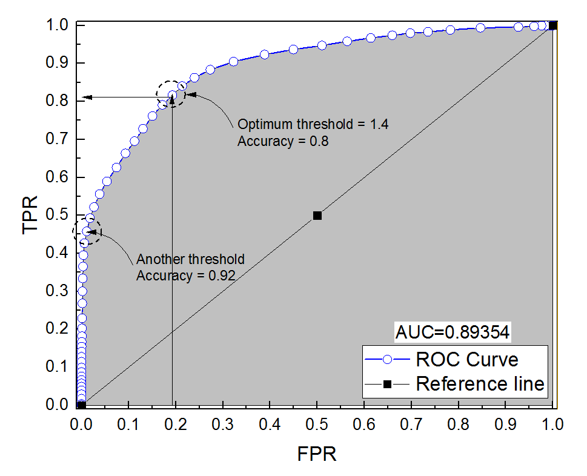

<!--
Options to add in the output with tint pakcage for different look
# tint::tintHtml: 
# tint::tintPdf:
-->

<!---
Changed font and background color from standard Tufte style
-->

<style type="text/css">

body{ /* Normal  */
      font-size: 20px;
      font-family:'Avenir Next';
      background-color:white;
  }
  
</style>

```{r setup, include=FALSE}
library(tufte)
knitr::opts_chunk$set(echo = TRUE)
```


In an effort to further understand the notion of algorithmic fairness and tie various threads of this course, today we will examine two ideas: predictive justice and individualized treatment. 

----------------

# **Predictive Justice**

## Background (Sec. 1 and Sec. 2)

Lazar and Stone^[Lazar and Stone (2021), On the Site of Predictive Justice, Working draft.] in their working paper draw 
a distinction between types of justice: 

a. outcome justice 

b. procedural justice ("treat like alike")

c. predictive justice 

Outcome justice and procedural justice constrain decisions. 
Predictive justice, instead, constrains predictions 
(which are not decisions, they are inferences). 

Why should predictions be constrained by norms of justice 
and not just epistemic norms, `r tufte::margin_note("Besides norms of justice and epistemic norms, a third type of norm might be relevant here: zetetic norms (see Jane Friedman's work).")` such as the probability axioms or a careful assessment of the evidence? 

Philosophers have explored 
a number of approaches to what we might call 'epistemic ethics', for example, 
epistemic injustice (Fricker), the wrongness of 
beliefs (Basu, Schroeder), moral encroachment (Basu, Bolinger). 
The claim that predictions should be constrained by norms of justice falls 
within this research in epistemic ethics. 

## Principles of Predictive Justice (Sec. 3)

Here is the key principle of predictive justice:

`r tufte::margin_note("From the Stanford Encyclopedia of Philosophy entry on Egalitarianism: Prioritarianism holds that the moral value of achieving a benefit for an individual (or avoiding a loss) is greater, the greater the size of the benefit as measured by a well-being scale, and greater, the lower the person's level of well-being over the course of her life apart from receipt of this benefit.")`

> "Prioritarian Performance Principle (PPP): A model is predictively just only if its performance for the members of historically disadvantaged groups cannot be improved without a disproportionate decline in its performance for historically advantaged groups." (p. 5) 


PPP is different from, but related to, the following:

> "Egalitarian Performance Principle (EPP): A model is predictively just only if its performance for the members of historically disadvantaged groups is roughly equal to its performance for members of historically advantaged groups."

PPP is better than EPP because:

> "EPP (but not PPP) would seem to recommend 'levelling down' for the sake of equality (making the model perform worse for the advantaged group without any improvement for the disadvantaged group). EPP would also regard a model that performs worse for historically disadvantaged groups than for the advantaged as predictively unjust even if it were infeasible to improve its performance for the former group; PPP would not." (p. 6)

What support PPP? Lazar and Stone offers four arguments, summarized below:

> "PPP is grounded in (i) a prioritarian emphasis on the special importance of ensuring accurate representation of members of historically disadvantaged groups, in virtue of both that very disadvantage in general, and their history of inadequate representation in society's epistemic practices and (ii) the importance of not perpetuating or participating in the cultural schemas that sustain that history of structural injustice. These arguments are exacerbated (iii) when the model is differentially accurate because of this very historical injustice—because it was shaped by the socially unjust past, for example; and (iv) when the model has been endorsed by an institution which owes an obligation to treat those represented in the model with equal concern and respect, and to remediate historical injustice." (p. 10)


## Innocent inequality (Sec. 4)

PPP is a situated norm of justice, not a norm of cosmic justice. PPP applies against the background of structural injustice that affects disadvantaged groups. 

Could a predictive model still perform differently for two  social groups even in absence of (or not because of) structural injustice? In principle, that's possible. That would be an innocent inequality.

> "We must also consider the reason for this particular difference in performance. If it is fully explained by an innocent inequality, then our reasons to remedy it are somewhat weaker than when it is due to background injustice, and so the costs we can reasonably impose on the advantaged group for the sake of a given benefit to the disadvantaged group are also somewhat less." (p. 12) 

Lazar and Stone, however, think innocent inequalities are rare in our society:

> "PPP only gives innocent inequalities a pass when they are genuinely innocent ... And while we can imagine clean cases of statistical artefacts, they may be rare in practice. In the United States, for the populations to whom predictive algorithms are in general applied, the different base rates with respect to many of the high stakes variables of concern are very clearly themselves caused by background injustice." (p. 12) 

## Measures (Sec. 5 and 6)

What measure should one use to assess conformity with predictive justice? Common measures of model 
performance are false positive rates (FPR), false negative rates (FNR), positive predictive value (PPV), negative predictive value (NPV). 

Computer scientists have focused on ensuring group equality across these measures. They have also shown the impossibility of concurrently achieving equality for all these measures across groups.
Since trade offs are inevitable, this approach also entails assigning different weights to different types of error, say assuming false positives are more harmful than false negatives.

Lazar and Stone think this approach is mistaken, at least from the standpoint 
of predictive justice. Focusing on equalizing these measures across 
groups and respecting desired trade offs goes beyond the realm of prediction into the realm of decision, 
which is outside the boundaries of predictive justice. 

> "If we give more weight to avoiding false positives than to avoiding false negatives ... this means building assumptions about how the model will be used into the evaluation of its epistemic performance." (p. 16)

```{r, fig.margin = TRUE, echo=FALSE, fig.cap="Plotting TPR (=1-FNR) against FPR", out.width = '100%'} 
 
```

The best performance measure suited for predictive justice is `r tufte::margin_note("Question: COMPAS perfoms equally well in terms of AUC for whites and blacks. Does that mean it is predictively just? If so, it seems virtually any predictive model would. So is predictive justice so easily met despite structural injustice?")` Area Under The Curve (AUC), an aggregate measure of the epistemic performance of a predictive model that does not keep track of differences in false positive and false negative rates. 


## Conclusion (Sec. 7)

Predictive justice matters, but....

>  "In our view, predictive justice is an important and worthwhile goal, but it is not, in itself, life and death. The decisions that these predictive models are used to support, on the other hand, might well be. When the stakes are as high as whether someone ends up pleading guilty to a felony of which they were in fact innocent, because it's the only way to avoid an extended period in jail awaiting an uncertain trial, matters of predictive justice pale by comparison. ... sometimes predictive models are used to support decisions that are actually very low stakes—for example, in consumer entertainment, such as face morphing or image sharpening apps. In those cases, where the actual impacts of the decisions on any particular person are relatively trivial, the predictive justice concerns rise to the fore." (p. 21)


----------------

# **Individualized Decisions**


The principle that people should be treated as individuals is intuitive. This principle applies even more clearly when the state exercises it coercive power by making decisions about detention and the deprivation of liberty because someone has committed or is at risk of committing a crime. 

The use of predictive algorithms in criminal justice to inform decisions about bail, pre-trial detention and sentencing seems to conflict with the right to be treated as an individual, because algorithms ultimately 
make decisions based on groups-based correlations that apply across the board to categories of people. 

So suppose there is a right to be treated as an individual, whether or not this right is explicitly recognized in constitutional law. What does this right, exactly, require?
Bolinger^[Jorgensen (2021). Algorithms and the Individual in Criminal Law. *Canadian Journal of Philosophy*, 1-17.] identifies a few key features:

i. A claim that high-stakes legal decisions be personalized, rather than being subjected to ‘one size-fits-all justice.’

ii. A claim to be respected as a presumptively law-abiding citizen, unless and until one defeats
this presumption through one’s own action and behavior.

iii. A claim to not be subject to extra burdens simply on account of one’s social identity, or
group memberships

iv. A claim to an explanation for the State’s exercise of coercive powers

v. A claim to fair distribution of the benefits and burdens of public law.


