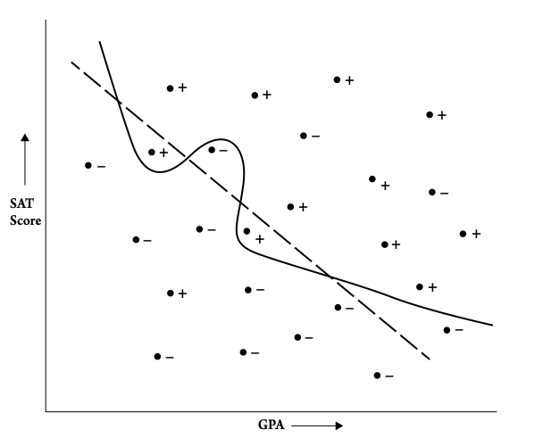
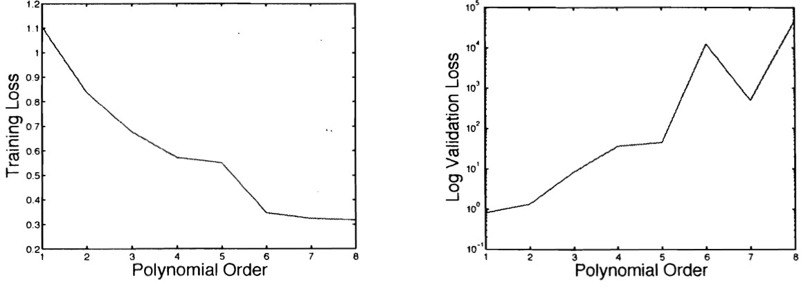

```{r setup, include=FALSE}
knitr::opts_chunk$set(echo = TRUE)
```

# An anecdote

Douglas Hofstadter, the legendary author of 1979 *Gödel, Escher, Bach: an Eternal Golden Braid*, during a talk at Google in 2014, said: 

> I sat down at my piano and played one of EMI's mazurkas "in the syle of Chopin". `r tufte::margin_note("EMI stands for Experiments in Music Intelligence by musician David Cope.")`
It didn't sound exactly like Chopin, but it sounded enough like Chopin, and like coherent music, that I just felt *deeply* troubled ... there is *nothing* more human in the world than the expression of music. Nothing. The idea that pattern manipulation of the most superficial sort can yield things that sound as if they are coming from a human being's heart is very, very troubling (p.9). `r tufte::margin_note("Might algorithms and AI more generally just show us that we are not as special, complex, deep and uniquely human as we thought?")` ... I find it terrible, horrifying, bizzare, baffling, bewildering, that people are rushing ahead blindly and delirously in creating these things (p.11).^[Hofstadter's words quoted in Mitchell (2019), *Artificial Intelligence*, Picador]

#  Methodological points


Algorithmic fairness can be studied through different disciplinary 
lenses: computer science, philosophy, law, economics, sociology, history, 
anthropology. We will read contributions from scholars in different disciplines 
and be mindful of their scholarly backgrounds. 

We will approach the topic *bottom up*. `r tufte::margin_note("Another way to proceed would be *top down*, giving more prominence to the philosophical arguments right from the beginning.")` We will first examine how algorithms work, how they are used, what worries they raise. We will then turn to philosophical questions concerning fairness and equality, while also reading contributions from scholars outside philosophy.   

The topic of algorithmic fairness is (a) *technical* (how do algorithms work?), (b) *practical* 
(how are people's lives affected by algorithms?) and (c) 
*theoretical* (what does fairness mean?). Not to lose 
sight of the big picture, we will cover these three dimensions.  


----------------

(a) `r tufte::newthought('Let')`'s start with the **technical** side of things. 


# Algorithms

An algorithm is a series of precisely defined steps for performing a task.`r tufte::margin_note("How precisely specified should the steps be?")` Given a set of *inputs*, the algorithm returns an *output*. 

An *example* is an algorithm for sorting numbers in ascending order.`r tufte::margin_note("Can you think of how the sorting algorithm would work?")`
Another example is the PSA algorithm (Public Safety Assessment) used to predict people's future criminal behavior.`r tufte::margin_note("Check out the website: https://advancingpretrial.org/")` 

## Machine Learning algorithms

Algorithms are traditionally written by a human, say a programmer using Python or C++. 
However, Machine Learning algorithms are *self-programming*.`r tufte::margin_note("*Self-programming?* This is less fancy than it sounds. We are talking about 
minimizing a (very complicated) cost function. It's calculus.")`
They are meta-algorithms whose input are historical data 
and whose output is another algorithm. Machine Learning algorithms are used in face 
recognition, translation, prediction, etc. 

## Example

Say you want to *predict* someone's college graduation (*outcome variable*) 
given known information prior to graduation, such as data about someone's 
high school GPA and SAT score (*input variables*). 

To do that, the first step is to collect historical data about 
people high school GPA and SAT scores as well as their 
college graduation. These historical data are 
used as *training data*. `r tufte::margin_note("How do you know the input variables you need?")`

The meta-algorithm *searches through all models*, say possibles lines through the data. `r tufte::margin_note("Lines are good for 2-dimensional data (e.g. SAT and GPA) and a binary outcome (graduate/not graduate).")` By a process of *optimization*, the meta-algorithm selects the model (first-order algorithm) that minimizes errors.  

This is an example of *supervised learning*. 
The model learns by comparing its prediction with the actual outcome in the training data. 

```{r, echo=FALSE, fig.cap="High school GPA and SAT scores (input variables) and college success (+ or -). The lines through the data are two possible models. Which one is the better model? (Source: Kearns and Roth (2020))", out.width = '100%'}
 
```


The resulting algorithm or model can be applied to new data (without the outcome) to 
predict college graduation for people not in the historical data.`r tufte::margin_note("Another example is the Titanic dataset (https://www.kaggle.com/c/titanic). How to predict who would (not) survive?")`


## Overfitting 


```{r, fig.margin = TRUE, echo=FALSE, fig.cap="", out.width = '150%'}
knitr::include_graphics("Olympics.png")
```

Consider data about winning men's 100m times at the Summer Olympics since 1896. We could draw a curved line that perfectly captures all the points. But this may result in *overfitting*. To guard against this, the historical data is split between training  and validation data.

```{r echo=FALSE, fig.cap="Minimizing loss on the training data might result in a higher loss in the validation data. The comoparison is a for datset about Men's 100m winning times at the olypimcs. Source: Rogers and Girolami, *A First Course in Machine Learning*", out.width = '100%'}

```


## Accuracy v. Fairness (According to Computer Scientists)

> ... it may be that the model that minimizes the overall error in predicting collegiate success, when used to make admission decisions, happens to falsely reject qualified black applicants more often than qualified white applicants. Why? Because the designer ... didn't tell the algorithm  to try to equalize the false rejection rates between the two groups, so it didn't. (p. 10).
> 
> Writing down precise definitions that capture the essence of critical and very human ideas without becoming overly complex is something 
of an art form, and it is inevitable that in many settings, simplifications---sometimes painful ones---are necessary \dots [This] tension ... reflects the inherent difficulty of being precise about concepts that previously have been left vague, such as "fairness." We believe that the only way to make algorithms better behaved is to begin by specifying what our goals for them might be in the first place (p. 12-13).^[Kearns and Roth (2020), *The Ethical Algorithm*, Oxford University Press]


----------------

(b) `r tufte::newthought('Let')`'s turn to how algorithms 
affect **people's lives**.  


# Example 1: Allegheny Family Screening Tool (AFST)

The ASFT algorithm helps social workers to determine whether a child is 
at risk of abuse and maltreatment by their parents. Even though the algorithm's judgment is not the sole deciding factor, a high risk score by the algorithm may trigger an investigation and result in the child's removal and placement in foster care.^[Chapter 4 of Eubanks (2018), *Automating Inequality*, Picador] 

- *Outcome variables*: proxies for child maltreatment: (a) call and referral to Child and Youth Services (CYS), and (b) child placement in foster care. `r tufte::margin_note("Are these proxies good ones?")`

- *Predictive variables*: stepwise probit regression, tested 287 variables and eliminated 156, leaving 131 predictors

- *Validation*: Receiver Operating Characteristics (ROC) is 76\%

> `r tufte::margin_note("Eubank's assessment criteria for predictive algorithms deployed in social services, p. 212: (1) Does the tool increase the self-determination and agency of the poor? (2) Would the tool be tolerated if it was targeted at non-poor people?.")`... the AFST has inherent design flaws that limit its accuracy. 
It predicts referrals to the child abuse and neglect hotline and removal of children from their families---hypothetical proxies for child harm---not actual maltreatment. The data set it utilizes  contains only information about families who access public services, so it may be missing key factors that influence abuse and neglect. Finally, its accuracy is only average. It is guaranteed to produce thousands of false negatives and positives annually (p. 145-146).  


<!---
> I fear that we are winning the fight against mass incarceration at just the historic momement
when the digital poorhouse makes the physical insititution of the prison less necessary. Corporations already anticipate the immense cost savings of building a digital prison 
state without walls (p. 215) 	
-->

# Example 2: For profit university ads

For profit universities, such as University of Phoenix, target people with the promise of an education and upward mobility. But, instead, they often saddle them with debt after ripping a huge profit. They use predatory advertising to target people in economic distress.^[Chapter 4 of O'Neil, *Weapons of Math Destruction*, Broadway Books] 

 > `r tufte::margin_note("ONeil's diagnosis of the three characteristics of a Weapon of Math Destruction (WMD) on p. 31: (1) Opacity, (2) Scale, (3) Damage")` ... advances in natural language [processing] have opened up a mother lode of possibilities for advertisers. The programs "know'' what a word means, at least enough to associate it with certain behaviors and outcomes, at least some of the time. Fueled in part by this linguistic mastery, advertisers can probe for deeper patterns. An advertising program might start out with the usual demographic and geographic details. But over the course of weeks and months it begins to learn the pattern of the people it's targeting and to make predictions about their next moves. It gets to know them. And if the program is predatory, it gauges their weaknesses and vulnerabilities and pursues the most efficient path to exploit them (p. 77).	


----------------

(c) `r tufte::newthought('Let')`'s turn to some **conceptual** questions. 

From the discussion so far, we should extrapolate ways in which algorithms can be regarded 
as unfair, unjust or morally objectionable. 

- What did Kearns and Roth think the problem of algorithmic fairness could be? How did they think 
it should be addressed?

- Why did Eubanks and O'Neil think that the algorithms they presented were unjust? Are they concerned with the same problem?

- Which perspective on algorithmic fairness  do you thinkis the most important? Both? Neither?

