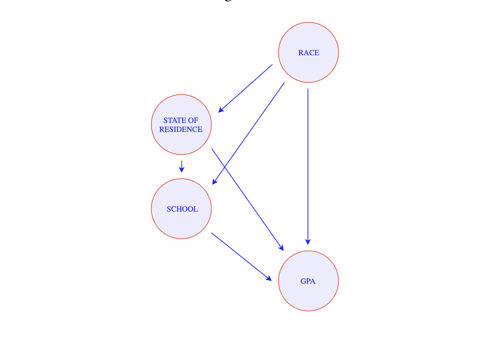

<!--
Options to add in the output with tint pakcage for different look
# tint::tintHtml: 
# tint::tintPdf:
-->

<!---
Changed font and background color from standard Tufte style
-->

<style type="text/css">

body{ /* Normal  */
      font-size: 20px;
      font-family:'Avenir Next';
      background-color:white;
  }
  
</style>

```{r setup, include=FALSE}
library(tufte)
knitr::opts_chunk$set(echo = TRUE)
```


Our goal is to understand, first, the differences between statistical and causal criteria of algorithmic fairness, and second, why either of these criteria  offers an inadequate theory of discrimination. A good theory of discrimination should be able to address three questions. 1. What is discrimination? 2. How do we detect it?
3. Why is it wrongful? By reading Lily Hu's work, we will examine whether
the proposed accounts of algorithmic fairness 
answer these questions. 


# **Statistical and Causal Approaches** 

Earlier^[See Class Notes Week #5.] we discussed several criteria of algorithmic fairness, such as 
demographic parity, predictive parity and classification parity. These criteria are akin to the notion of *disparate impact* in discrimination litigation.`r tufte::margin_note("We'll talk about disparate impact later in the course. Disparate impact (roughly) measures the extents to which two different groups are unevenly affected by a decision, say because equally qualified applicants belonging to different racial groups have different chances of being hired (similar to a violation of classification parity).")`  We also saw how these statistical criteria 
can be manipulated. Recall, for example, this quotation from a paper we read:

>   "Suppose ... prosecutors start enforcing low-level drug crimes
that disproportionately involve black individuals ... 
suppose that the newly arrested individuals have low risk of violent recidivism, and thus are released pending
trial. This stylized policy change alters the risk distribution of black defendants, adding mass to the left-hand
tail. As a result, the false positive rate for blacks would decrease ... Without considering the
distribution of risk---and in particular, the process that gave rise to that distribution---false positive rates
can be a misleading measure of fairness" (p. 15).^[Corbett-Davies and Goel (2018), [The Measure and Mismeasure of Fairness](https://arxiv.org/pdf/1808.00023.pdf)]

Since they can be manipulated, statistical criteria do not seem to offer an adequate 
answer to the question, what is discrimination? More recently, however, a different approach toward 
algorithmic fairness has been taking shape. Lily Hu^[Disparate Causes, [Part I](https://phenomenalworld.org/analysis/disparate-causes-i), *Phenomenal World*, 2019.] 
describes it thus:

> "It is an arguably more straightforward way of looking at whether a system has wrongfully discriminated by asking the following question: Is race (or sex, gender, religion, and so on) inappropriately affecting the system’s decision in some way? ... To answer this question, it's thought, we have to get a *causal* picture of how decisions are made. We have to ask: what are the cause-effect relationships between relevant attributes that lead to a decision? More bluntly: does the attribute of race *cause* a particular decision outcome?"

Randomized controlled experiments -- audit studies -- are considered the gold standard for such a methodology:

> "two units are presented as identical in all respects, but each receives a randomized race treatment ... Any differences in the measurable outcome between differently raced units are thus attributed to race."

For example, in order to check whether hiring practices are racially discriminatory, a randomized controlled study compares equally qualified applicants that differ only by race. If differences in hiring rates persist across racial groups, this is considered evidence that race has a direct effect on hiring -- and that's discriminatory.^[See Bertrand and Mullainathan (2004), [Are Emily and Greg More Employable Than Lakisha and Jamal? A Field Experiment on Labor Market Discrimination](https://www.aeaweb.org/articles?id=10.1257/0002828042002561), *American Economic Review*, 94 (4): 991-1013.] 

This approach aims to measure the *direct effect of race* and assumes a *counterfactual* understanding of discrimination. The question is, had the person been of a difference race (or sex, religion, etc.), would they have been treated differently *all else being equal*?

# **What Causal Approaches Are Missing** 

Audit studies about discrimination treat race as a variable that can be manipulated *all else being equal*. 
But how can we counterfactually change someone's race and assume that all else is equal? More specifically, Hu argues that:

(a) The causal counterfactual approach conflicts with constructivist views of race, commonly held by social scientists:

>  "If ...  race is a social category constituted by a set of social practices, institutions, norms, expectations, and so on, then to speak of a decision as being "directly caused" by race WHITE or race BLACK is incoherent ... [an account] that sees race as something that can be isolated from confounders and mediators such as "socioeconomic status" or "high school performance" rests upon an incorrect theory of *what race is*---and why it matters in our society."

`r tufte::margin_note("Recall the three questions:
(1) What is discrimination?
(2) How do we detect it?
(3) Why is it wrongful?
The causal counterfactual view answers:
(r1) A decision is discriminatory when it is caused by race when race is irrelevant. 
(r2) Discrimination is detected by controlling for race in audit studies.
(r3) Discrimination is wrongful because it is irrational.
")` 

(b) The approach reduces discrimination to irrationality:

>  "if the category of race is just a surface-level trait, untethered to broader social facts, and Gregs are nevertheless consistently preferred over Jamals, then these asymmetries are evidence of irrationality on the part of the decision-maker ... the wrongful nature of the disparate outcomes can be understood to refer to the irrationality of a decision-maker’s response to that surface-level category"


(c) The irrationality view of discrimination is wrong:

`r tufte::margin_note("Does Hu believe that discrmination is, after all, rational? See difference between taste-based discriminaton and statistical discrimination in Becker (1957), The Economics of Discrimination")` 

> "But the discrimination-as-irrationality view surely can't be right ... There might in fact be a nonzero direct effect of race between Katies and Claires ... And if discrimination were really reducible to a notion of irrationality, the Katie and Claire audit study would perhaps be more interesting, since it would present us with a truly strange, seemingly *sui generis* phenomenon of irrationality."


(d) The social constructivist view 
(which conflicts with the causal counterfactual approach) 
is a better fit:

`r tufte::margin_note("What answers would a social constructivist view of discrimination give to the three questions?
")` 

> Only the social constructivist view of race can explain why audit studies typically "manipulate" units across categories like race, and not across categories like first letter of first name. ... the names Greg and Jamal correspond to the cultural and historical material that make up our notions of whiteness or Blackness.


# **Path Specific Causal Fairness** 

But the causal approach can be further refined.^[Hu (2019), Disparate Causes, [Part II](https://phenomenalworld.org/analysis/disparate-causes-pt-ii), *Phenomenal World*] We need not just measure the direct effects of race, but also its indirect effects:

> The Path-Specific Effects advocate ... admits that many aspects of one's life are influenced by race prior to a particular decision `r tufte::margin_note("The path specific approach shifts the perspective on the agents of discrimination from situated individuals or institutions to society as a whole.")` ... An audit study following this reasoning would claim that Jamal's counterpart is not just Greg who is white while otherwise identical to him, but some Greg whose résumé features are altered to account for the fact that on average, Greg, being white, probabilistically faced fewer obstacles than Jamal in feeling safe at school, taking the SAT, being recommended to enroll in AP English, and so on. This white Greg—call him Greg1— is Jamal's counterpart under the Path-Specific Effects approach, and a decision process cannot treat the two differently if it is to be non-discriminatory. 

This approach makes some progress toward capturing a constructivist view of race. The role of GPA, SAT, school, neighborhood are no longer factored out, artificially assuming that black and white applicants could be equal along these metrics and just different in their race. But a question remains. Who is Jamal's white counterpart? 

> "When we toggle Jamal’s race attribute from BLACK to WHITE and cascade the effect to all of his “downstream” attributes, he becomes white Greg. Who is this Greg? ...  `r tufte::margin_note("The test for discrimination here is this: Jamal's white counterpart (say, Greg1 or Greg2) in a suitably defined counterfactual world is treated differently from Jamal in this world.")`Is it Greg1, a white male who is a junior at Pomona High School with a 3.9 GPA (adjusted for the average Black-White GPA gap at Pomona High School)? Or is it Greg2, a white male who is a junior at nearby Diamond Ranch High School---the predominantly white school in the area---with a 3.82 GPA (accounting for nationwide Black-White GPA gap)? Which counterfactual determines whether Jamal has been treated fairly?"

Perhaps, demanding a full picture of Jamal's white counterpart is too much. But, at least, 
in manipulating the variable "race" from BLACK to WHITE, we will have also to adjust the GPA of Jamal's white counterpart to account for how race causally affects downstream GPA performance. How do we do this adjustment?

Hu writes:`r tufte::margin_note("Could the relevance of a comparison group rather than another (say, state-level versus nation-level) depend on the type of discrimination question at stake? Discrimination claims are circumscribed to a time and place.")`

> "To make this adjustment, should the decision process transform Jamal's GPA according to a nationwide metric---perhaps the national Black---White GPA gap? Perhaps the school-specific GPA gap? The state-wide gap? Perhaps a metric that only measures the Black-White gap among high school juniors?  To what criteria should we refer in order to decide?"


```{r, echo=FALSE, fig.margin = FALSE, fig.fullwidth = FALSE, fig.cap="Different paths toward Jamal's GPA via the race variable"}
 
```

# **Causal Fairness Claims v. Normative Fairness Claims** 

Hu holds that our normative judgments about the wrongness of racial disparities in historical data have priority to causal counterfactual assessment:

> "Judgments about fairness and discrimination come to us as normative valuations about why certain *observational* data of decision outcomes are wrongfully racially biased. These valuations might be *explained* in causal terms, but they are not *founded* on causal reasoning. Normative assessments of observational outcomes inform the structure of our causal diagrams, not the other way around." 

Hu believes that if the counterfactual analysis were to disagree with our normative judgments about fairness, we would have to change the former not the latter. Here is an example in which answering the causal question is irrelevant 
to the fairness question:

> "The gaping health disparities between white people and Black people in the U.S ... `r tufte::margin_note("Wouldn't the causal counterfactual question be relevant to understanding (a) under what conditions the injustice came about and (b) how the inustice can be addressed?")` Whatever health Black people “would have had” in some convoluted counterfactual scenario is frankly irrelevant to the question of whether actually existing inequality is a matter of injustice."


